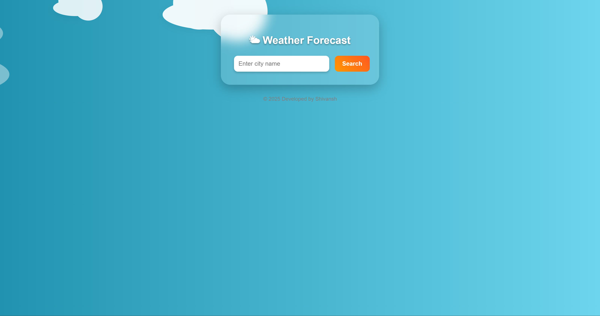
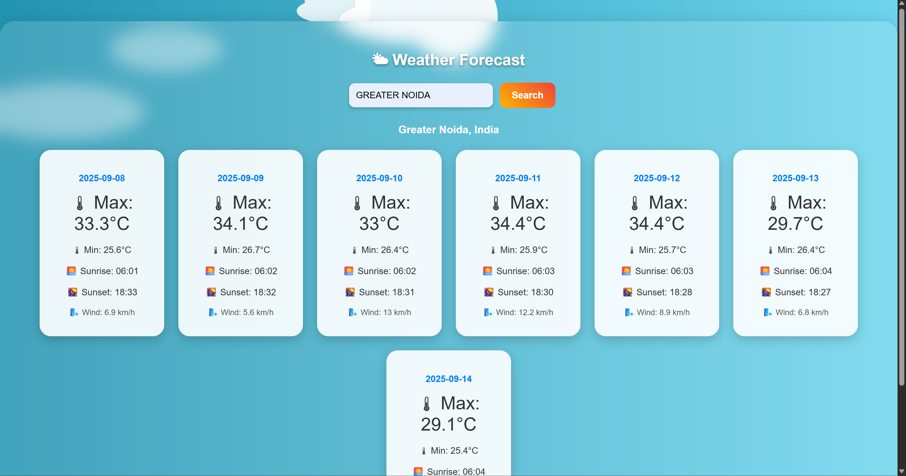
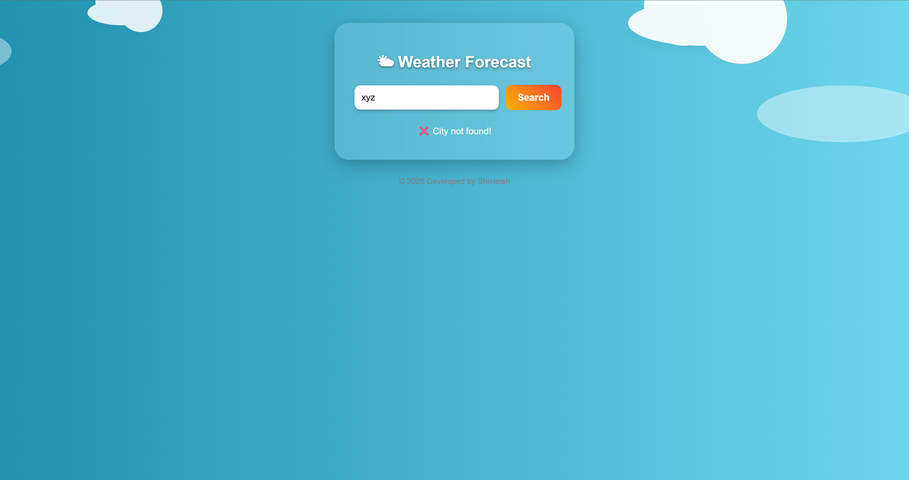

# 🌦️ WeathTouch  

**WeathTouch** is a modern and responsive **Weather Forecast Web Application** built with **HTML, CSS, and JavaScript**.  
It fetches real-time weather updates using the **Open-Meteo API** and provides a **5-day forecast** with sunrise & sunset timings.  

---

## 🚀 Features  
✅ Search weather by **city name**  
✅ **5-day forecast** (max/min temperature, sunrise & sunset)  
✅ Clean & **responsive design**  
✅ Weather icons for conditions (☀️ 🌧️ ⛅)  
✅ Error handling for invalid inputs  

---

## 🛠️ Tech Stack  
- **Frontend:** HTML5, CSS3, JavaScript (Vanilla JS)  
- **API:** [Open-Meteo Weather API](https://open-meteo.com/)  
- **Icons:** Unicode + Custom styling  

---

## 📸 Screenshots

### 🏠 Home Page  


### 🌤️ Weather Forecast Example  


### ⚠️ Error Handling  



---

## ⚡ How It Works  
1. User enters a city name.  
2. **Geocoding API** fetches latitude & longitude.  
3. **Weather API** retrieves a 5-day forecast.  
4. Results are displayed with cards & icons.  

---

## 🔧 Installation & Setup  

Clone the repository:  
```bash
git clone https://github.com/Shiva-1220/weathtouch.git
